# Migrate For Anthos Demo

***this is meant for demo purposes only***

## Description
Demonstration of migration of a Stateful Virtual Machine to a container using Migrate for Anthos. In this demo we will deploy the required infrastructure using Config Controller and deploy the migrated aplication to a security enforced cluster using Anthos Config Management.

## Usage

Enable the Services

```
gcloud services enable krmapihosting.googleapis.com \
    container.googleapis.com \
    cloudresourcemanager.googleapis.com
```

Create the Controller Instance
```
gcloud anthos config controller create migrate-demo --location northamerica-northeast1
```

Set IAM Permissions

```
export SA_EMAIL="$(kubectl get ConfigConnectorContext -n config-control \
    -o jsonpath='{.items[0].spec.googleServiceAccount}' 2> /dev/null)"
gcloud projects add-iam-policy-binding "${PROJECT_ID}" \
    --member "serviceAccount:${SA_EMAIL}" \
    --role "roles/owner" \
    --project "${PROJECT_ID}"
```

Fill in `setters.yaml`

Populate Variables `kpt fn render`

Run `kpt live init --namespace config-control` followed by `kpt live apply`

### Configure Migrate For Anthos

Navigate to the migrate to containers tab in Anthos

 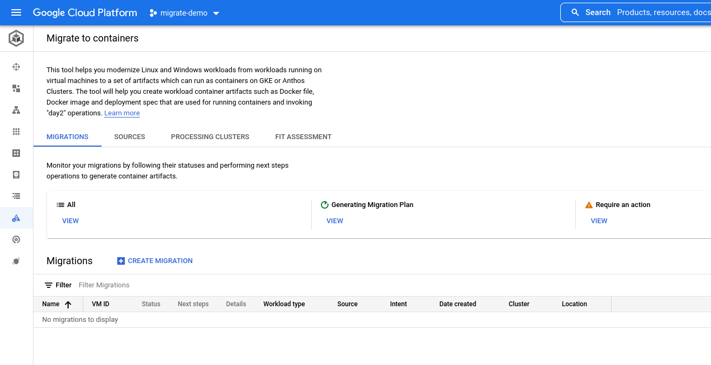

Our first step will be to create a Processing Cluster to do all of the heavy lifting of moving our VMs into containers. To do that we will need to select on of the clusters we create in the previous step `migrate-processing-cluster` by navigating to the processing cluster tab and clicking the *add processing cluster* button.

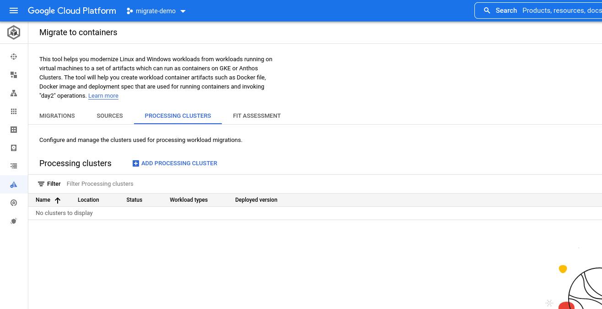

Select `migrate-processing-cluster` from the list you are presented with.

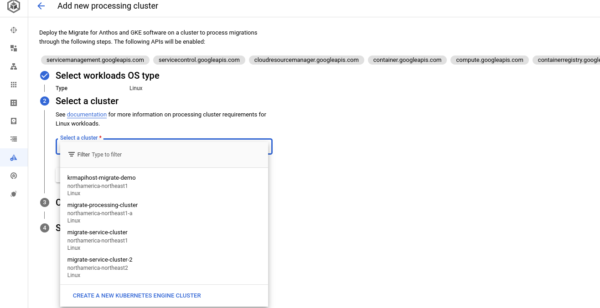

Next we will need to add a source which will connect to our GCE instance to migrate our candidate.

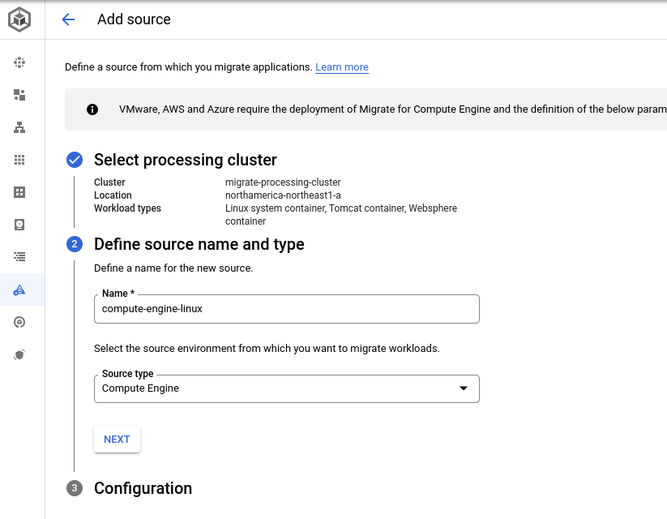

Now that we have our base migration infrastructure inplace we can move on to deploying some VM based apps and migrating them to containers.

### Deploy GCE Based App for Migration

For this demo we will deploy a Wordpress application from the cloudmarket place to make deployment easy.

Navigate to the Marketplace and select the Wordpress Icon under Virtual Machines


I went with the defaults but changed the location to be in Canada and turned off the firewalls and https as I won't be exposing this to public traffic in the demo.

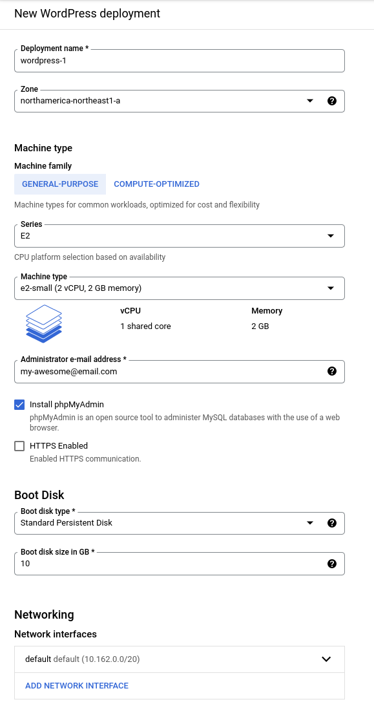

This will take a few minutes to come up and it may give you a timeout warning but the application is up and running if you look at the vm. Once the VM is up and running we can proceed with our first step which will be to do a Fit Assessment to determine an ideal home for the migrated app. To start that process will need to access the wordpress VM to run some the commands to produce the report.

```
gcloud compute --project=migrate-demo-348420 firewall-rules create default-allow-ssh \
  --direction=INGRESS --priority=1000 --network=default --action=ALLOW \
  --rules=tcp:22 --source-ranges=35.235.240.0/20 --target-tags=wordpress-1-deployment
```
```
gcloud compute ssh wordpress-1-vm --tunnel-through-iap --zone northamerica-northeast1-a
```

Download the tools and generate the report

```
mkdir m4a && cd m4a
curl -O "https://mfit-release.storage.googleapis.com/1.11.0/mfit-linux-collect.sh"
chmod +x mfit-linux-collect.sh
curl -O "https://mfit-release.storage.googleapis.com/1.11.0/mfit"
chmod +x mfit
sudo ./mfit-linux-collect.sh
```

The `mfit-linux-collect.sh` script generates a json report that we run the `mfit` tool against for our assessment report. You can view the file by running `ls`, note the time stamp as you will need to use that to replace `TIMESTAMP` in the following command.

./mfit assess sample m4a-collect-wordpress-1-vm-service-TIMESTAMP.tar --format json > wordpress-mfit-report.json

Download the file
```
gcloud compute scp --tunnel-through-iap \
  wordpress-1-vm:~/m4a/wordpress-mfit-report.json ${HOME}/
cloudshell download ${HOME}/ledgermonolith-mfit-report.json
```

Now that we have the Fit Assessment downloaded we'll need to upload it to the Fit Assessment tool

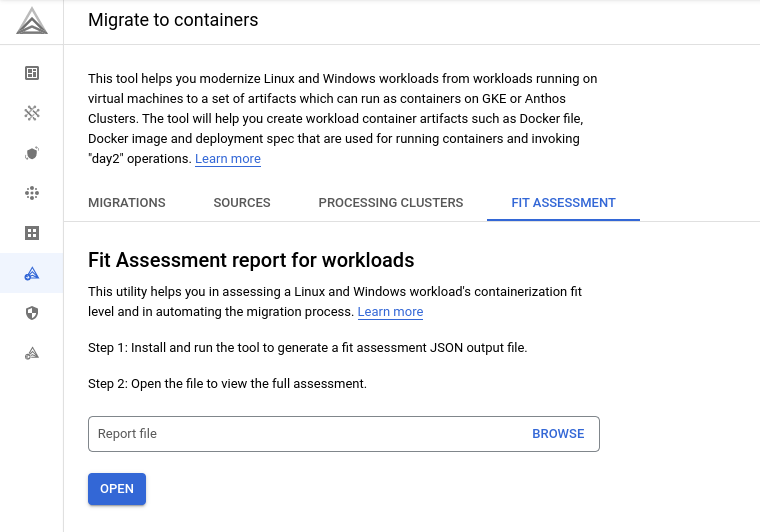

Click on browse and navigate to the assessment report you downloaded in the previous step to select it. Once selected click the open button to view the report. The page will now change to show you a selection of reports available in the assessment, in our case we should just have the one for `wordpress-1-vm`.


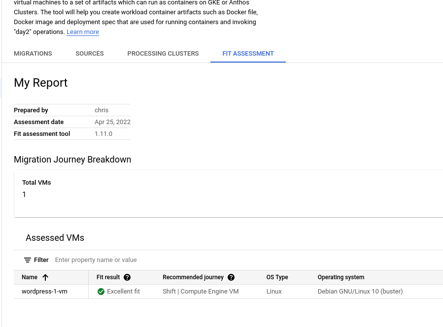

We can see that our recommendation journey is for VM but we want to move this to a container so lets up open up the report and see what it says. 

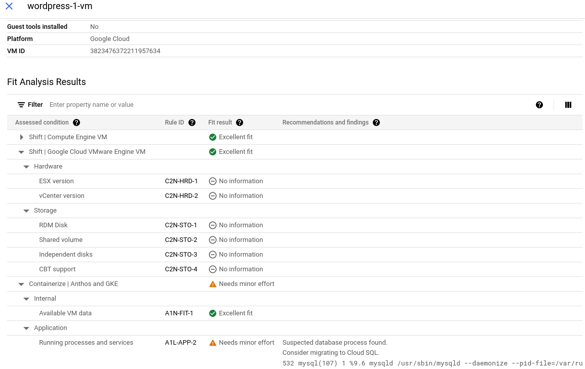

Looking at the report we can see it's flagged a migration to containers as needing "minor effort" due to a database residing in the VM and a migration to a hosted Cloud SQL solution is the recommended fix. 

Now that we know what we're getting into lets actually migrate the app. To do that we'll need to navigate to back to compute engine page and stop the VM and once that is done we'll need to return to the migrations tab

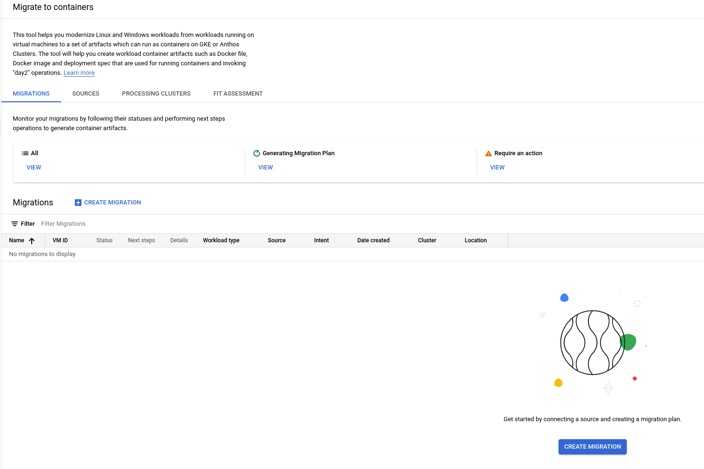

To start the migration proccess click the create migration button and fillout the form that pops up and click create once complete.

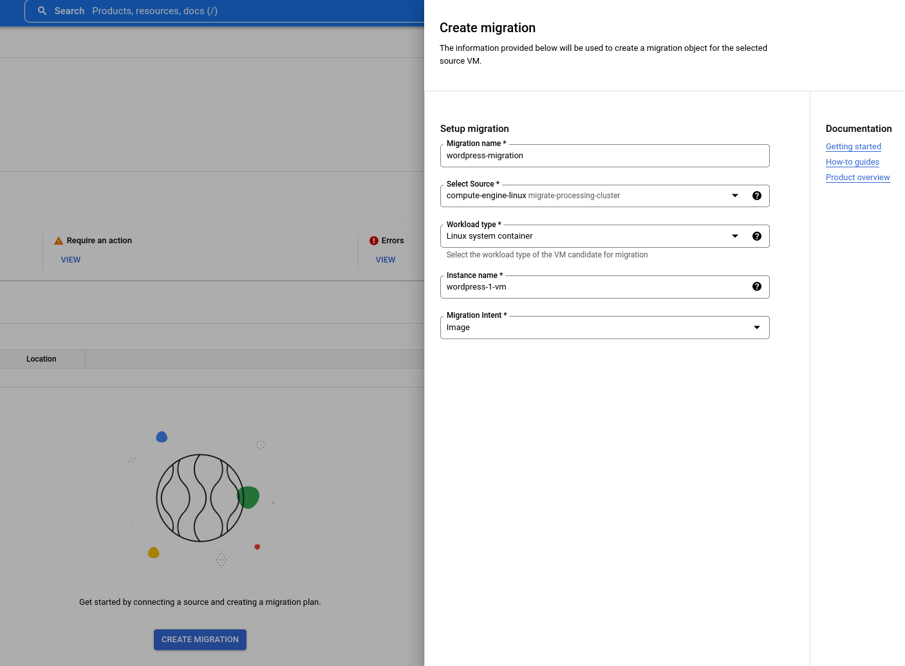

This will generate a migration plan in a few minutes. Once it is finished we can click on the dropdown in next steps and generate our artifacts (Dockerfile, Deployment configs). This will take a while so feel free to take a break or grab a beverage.

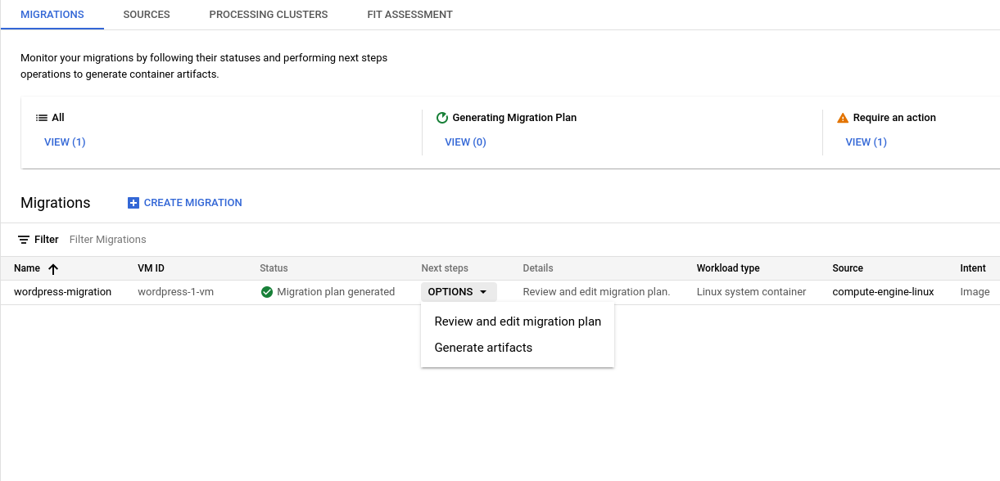

When that finishes you should have some shiny new artifacts you can download and play with. Once important thing that comes out of this is the containers are already pushed to out container registry and if scanning is enabled you will already have a vulnerability report waiting for you.

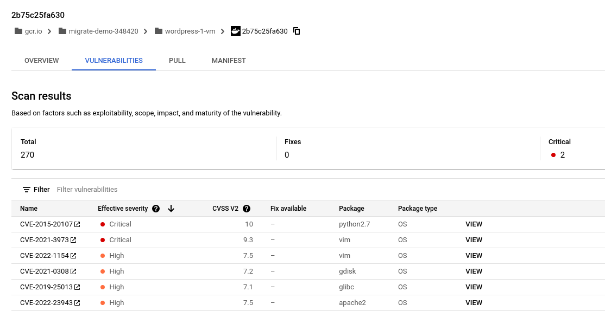

Next we'll move onto the deploying of the application to our 2 Kubernetes Clusters. 

We'll need to navigate back to the Migrate to Containers tab in Anthos. Once there click on the options drop down in the next steps column and select review artifacts. THis will take you to the artifacts page of the migration and here we'll be able to access the Dockerfile, Deployment configs, etc. For our purposes we'll want to download the deployment file, click on "Docker file, deployment spec and other artifacts" to be taken to the Bucket where the file lives.

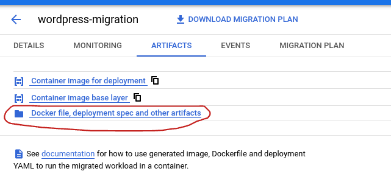

Click on the highlighted file and then one the next screen choose download, you should now see the deployment YAML. Copy this and create a new file called `deployment.yaml` in the apps directory and copy the pasted content into it.

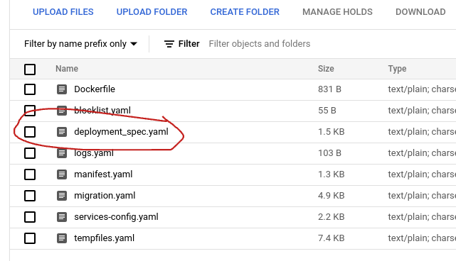

Part of this deployment we created a `Cloud Source Repository` and told `Anthos Config Management` to watch it for any configurations. What we'll do now is push these local configs to that repository so it can be deployed to our Clusters with `Anthos Config Management`.

First off cd into the apps directory and initialize the repo
```
cd apps
git init
git remote add google https://source.developers.google.com/p/${project-id}/r/${project-id}-migrate-demo
```

Next we'll need to add our local configs to the git repository
```
git add .
git commit -m "first commit"
```

and finnally push them to the repository
```
git push --all google
```

Now we can go over to the `Config Management Tab` in Anthos to see how our deployment is going. It should turn green in less than a minute or so.

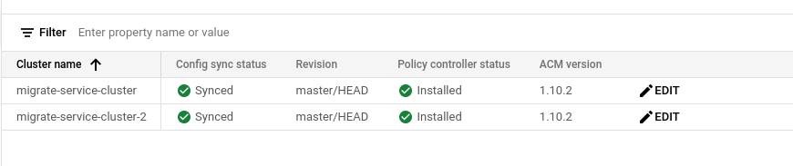

Over in the GKE Workloads view you should see two applications and


Part of the initial dpeloyment package was a security bundle to help enforce CIS Security Rules for Kubernetes. As you can see here our application was denied entry to the cluster because it has the `root` user enabled and this is not allowed by the bundle.

### Fetch the package
`kpt pkg get REPO_URI[.git]/PKG_PATH[@VERSION] infrastructure`
Details: https://kpt.dev/reference/cli/pkg/get/

### View package content
`kpt pkg tree infrastructure`
Details: https://kpt.dev/reference/cli/pkg/tree/

### Apply the package
```
kpt live init infrastructure
kpt live apply infrastructure --reconcile-timeout=2m --output=table
```
Details: https://kpt.dev/reference/cli/live/
